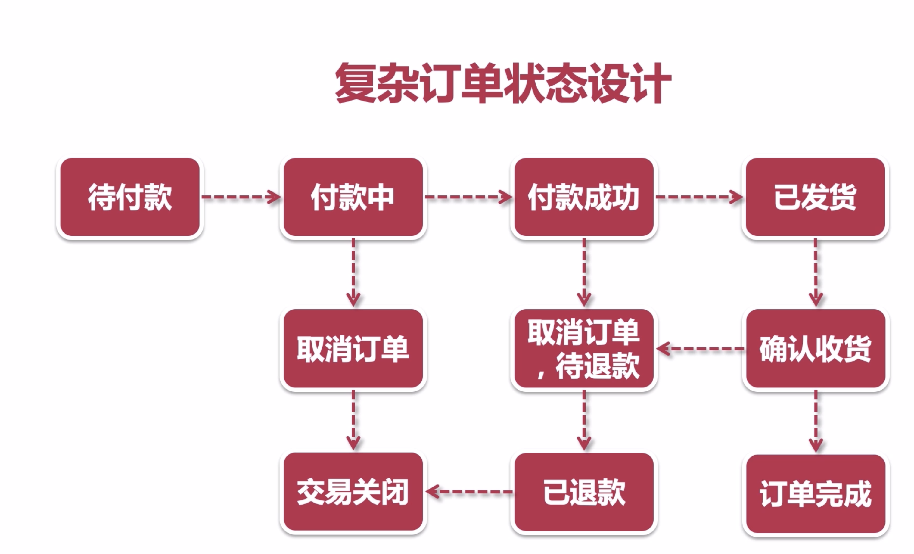

# Week3

### 一. 订单状态流转

### 二. 超卖问题(商品库存扣减到负数)的解决方案

1. JVM锁(syncronized或Lock)
   1. 问题
      1. 串行执行，性能低
      2. 分布式/集群环境下，无法保证线程安全
2. 数据库锁
   1. 问题
      1. 造成数据库额外的压力
3. 分布式锁
   1. Zookeeper分布式锁
   2. Redis分布式锁
4. 乐观锁
   1. 基于数据库状态

### 三. 内网穿透

内网穿透，即NAT穿透，通过映射端口，能让外网的电脑找到处于内网的电脑，提高下载速度。

### 四. 用户支付成功后，前端轮询订单状态

### 五. 基于SpringBoot的定时任务，关闭超时未支付订单

1. 仅适用于一些传统的、轻量级项目。弊端：
   1. 存在时间差，无法做到实时校验
   2. 集群环境下， 可能同时有多个任务实例在执行
      1. 解决方案
         1. 使用分布式锁
         2. 使用一台单独的集群，独立运行所有定时任务
         3. 使用MQ延时队列，实现定时任务
   3. 每次需要对数据库进行全表扫描，对数据库性能影响较大